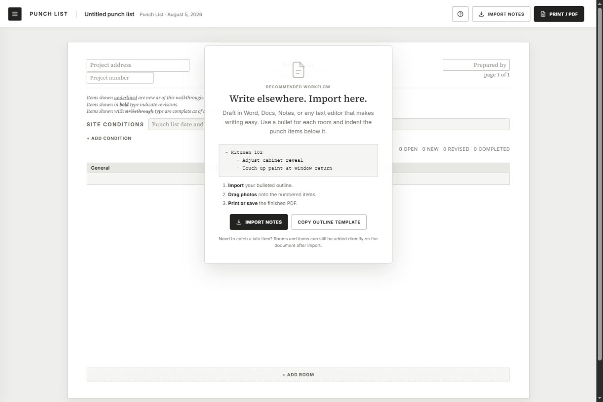
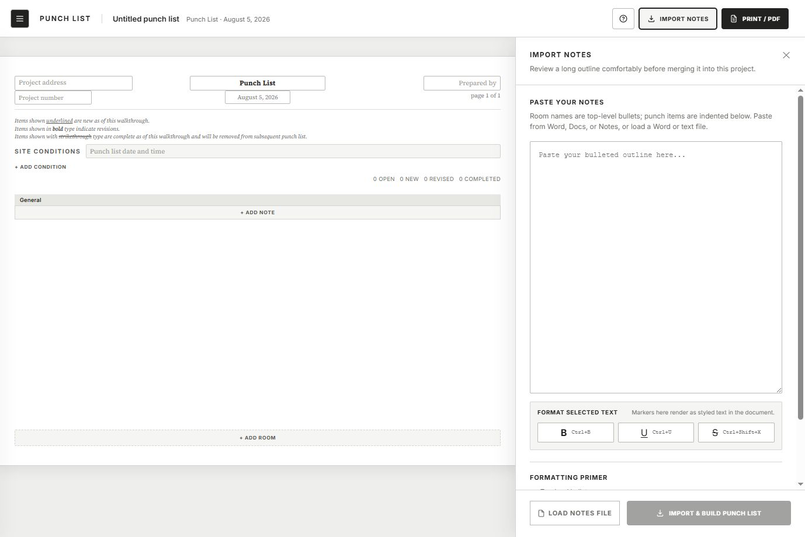
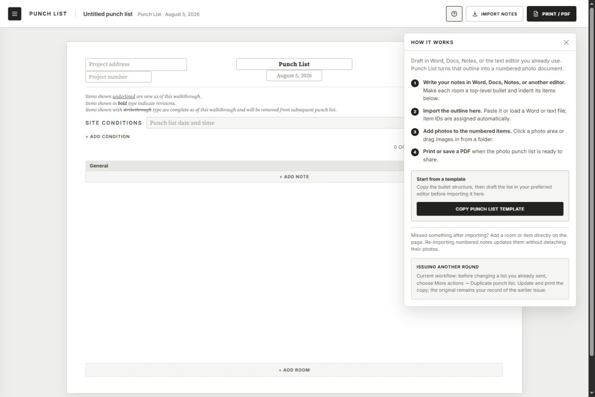

# Punch List issuance-flow audit

## Audit scope
The current path from a blank project to an imported, photo-ready punch list, followed by the way an architect or inspector sends a later round. This is a combined UX and visible-accessibility review grounded in the local app at a 1378 × 920 viewport.

## User goal and accessibility target
Create a clear, printable photo punch list quickly, hand it to a contractor, then update and issue the same project again without building a contractor-assignment platform. Important controls must remain understandable by label, keyboard, and visible state.

## Flow steps

### 1. Start a blank list — healthy after copy revision
The recommended workflow is visible immediately and keeps the metadata inputs blank. The revised text now names Word, Docs, Notes, and other text editors without implying that the user must draft inside Punch List.

### 2. Import and format an outline — improved
The full-height workspace is a strong fit for long outlines. Formatting had been invisible and depended on knowledge outside the screen; selected-text controls now expose Bold, Underline, and Strikethrough with Ctrl+B, Ctrl+U, and Ctrl+Shift+X. Empty-selection feedback tells the user how to recover.

### 3. Build the photo document — healthy core, richer example
The practice project now demonstrates three Site Conditions, three General Notes, and six rooms across four document pages. Stable numbered photo cells remain the clearest part of the product. The updated example structure and counts were verified in the live DOM, including 15 open, 14 new, 1 revised, and 1 completed.

### 4. Send another round — understandable interim, structurally weak
The current duplicate action is buried under More actions and does not communicate version history. How it works now explains the safe interim workflow: duplicate before editing, update the copy, and keep the original as the earlier issued record.

## Strengths
- The product promise is unusually clear: import a structured outline, attach photos to numbered items, and print a polished document.
- Persistent item numbers and visible photo targets support paper/PDF communication without requiring contractor accounts.
- The expanded notes panel, file import, and direct post-import editing support both planned walkthroughs and late discoveries.

## UX risks
- “Duplicate punch list” is a project-copy tool, not a real issuance model. A chain of copies makes it hard to know which document was actually sent.
- Item codes are still derived from the current room name. Renaming a room can change a code that may already exist on an issued PDF.
- Re-import can remove missing items, while direct removal permanently deletes them. Either behavior can erase issued history.
- Bold and strikethrough currently influence revised/completed counts. That is useful for today’s printed convention but should not become the source of truth for lifecycle state.

## Accessibility risks
- The new formatting controls have text labels, keyboard-shortcut metadata, focus styles, and live status feedback.
- The app still needs a full keyboard pass for focus order, visible focus after formatting, and operation of the rich-text description fields.
- Screenshot evidence cannot prove screen-reader announcements, print-dialog accessibility, or keyboard behavior inside browser-native print UI.

## Recommended product model
Keep one living project. Every send becomes an immutable **Issue** within it:

1. The author builds the working list and chooses **Issue PDF**.
2. A short preflight creates **Issue 01 · Aug 5, 2026** and opens Print/PDF.
3. The author continues working in the same project; item numbers remain stable.
4. The next send creates **Issue 02**, with a compact issue history and a way to reprint either snapshot.

Minimum supporting work:

- Persist each item’s issued code instead of recalculating it from a mutable room name.
- Add a compact issue-history disclosure with issue number, date, item count, and Reprint.
- Preserve the item text, location, code, layout, and photo version used by each issue.
- Move lifecycle meaning to explicit state; keep bold, underline, and strikethrough as optional document appearance.
- Review missing items during re-import instead of silently removing them.

## Evidence limits
The accepted screenshots above were captured and inspected in this run. The browser screenshot backend timed out when capturing the expanded four-page example, so that step was structurally verified through the live DOM but is not claimed as a full visual review. Full WCAG compliance was not assessed.

## Implementation follow-up — Aug 5, 2026
The recommended issue model is now implemented. Issue & Print saves the complete document and photo data in IndexedDB, locks the project, and records the issue in a bottom Issuances group. Unlock to correct opens a correction draft; Reissue & Print preserves the original snapshot, creates a numbered Correction, and locks again. Start next issue advances the issue number. Historical Reprint uses the saved snapshot, with a visible Return to working list recovery action if the browser does not fire its native after-print event.

The Import Notes workspace now uses a true rich-text outline editor. Bold, underline, and strikethrough appear directly in the editor and carry into the generated document; markdown markers are no longer exposed. The redundant formatting-example disclosure was removed, and the primer names the supported .docx, .md/.markdown, and .txt file types.
