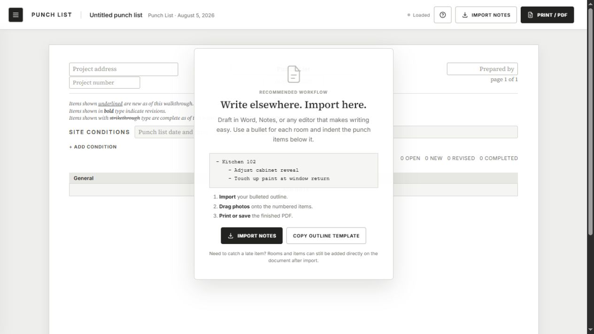
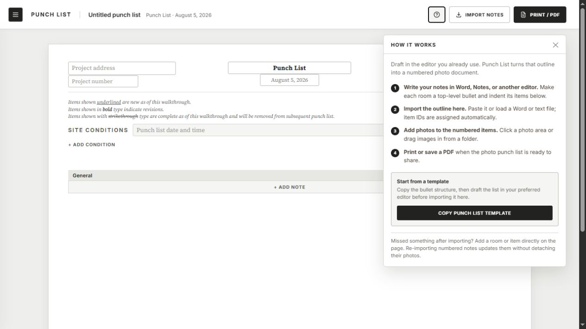
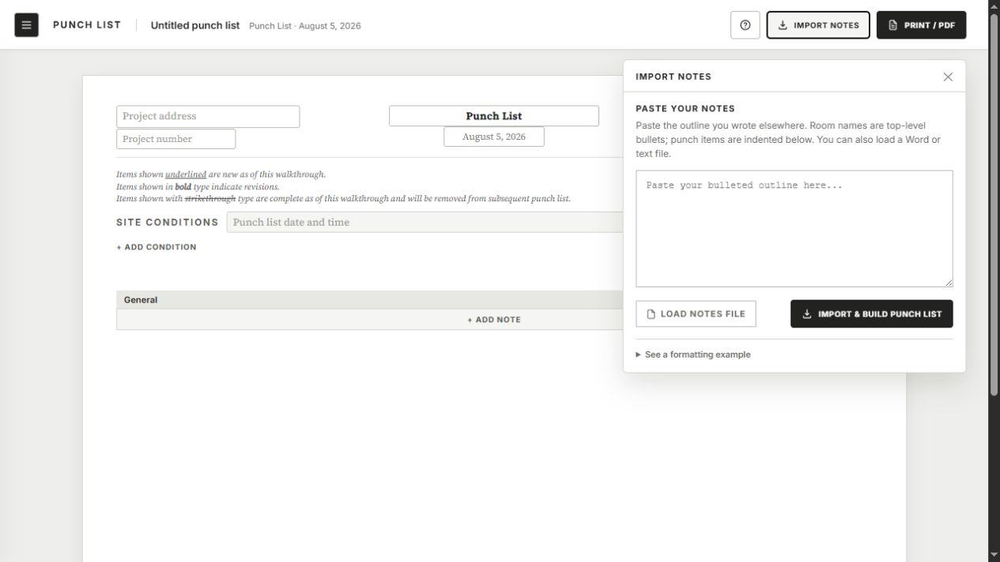
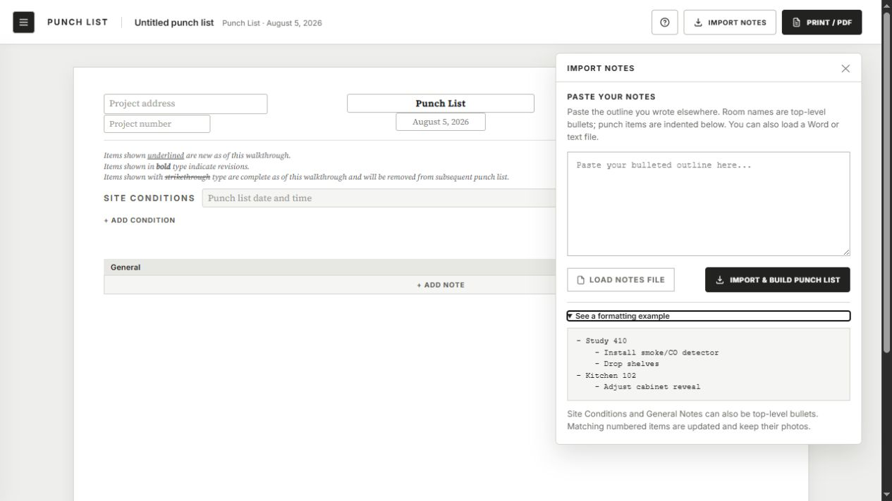
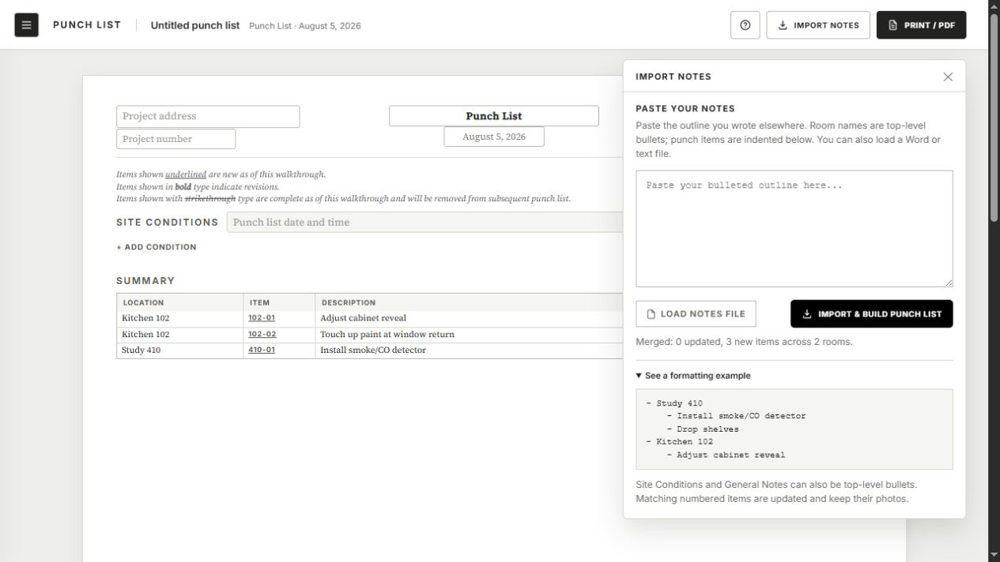
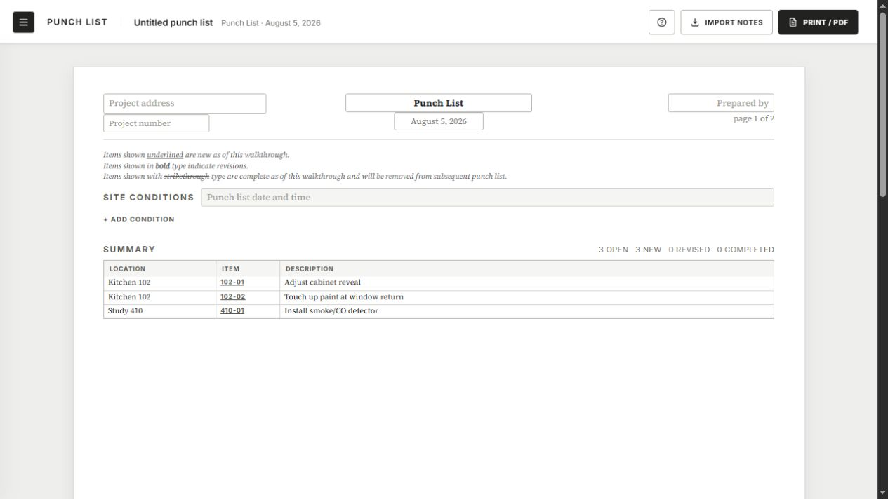
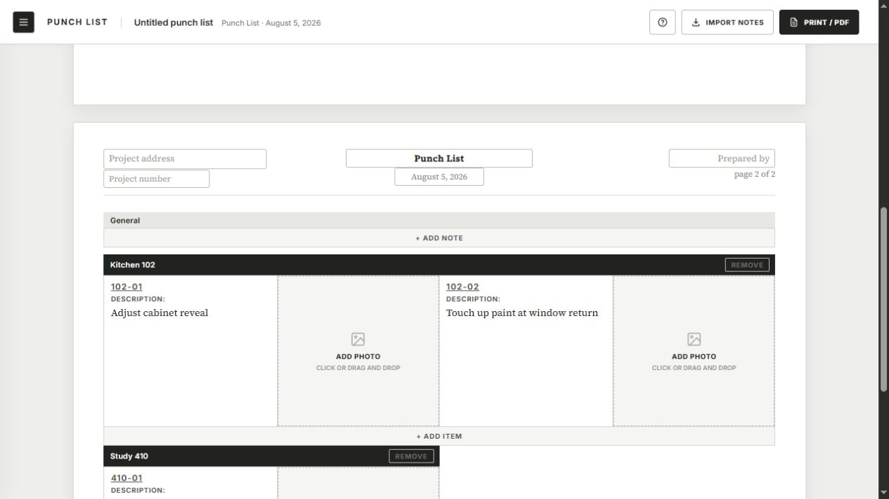
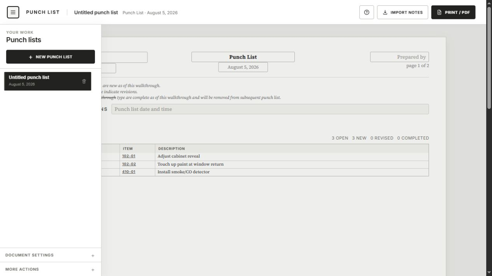
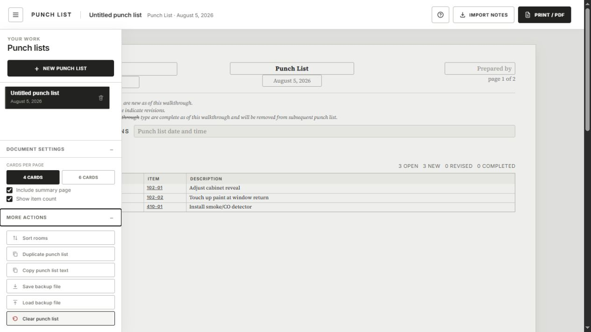

# Release-readiness UX/UI audit

_Audited: 2026-08-05_

## Scope

First-time desktop flow: blank punch list, onboarding, help, import, import feedback, generated summary, photo-detail page, project panel, and document/backup controls.

## Overall verdict

The core experience is credible and visually coherent. The monochrome construction-document style fits the job, the blank first-run state explains the import-first model, and a realistic outline imported cleanly into numbered summary and detail pages.

The largest release-readiness gaps are trust and handoff, not a visual redesign. Users need clearer help discoverability, a stronger import-success transition, protection from accidental deletion, a preflight before Print/PDF, and a clearer statement that work is saved only on the current device unless a backup is downloaded.

## Highest-impact changes for tonight

1. **Label the help control.** Keep `How it works` visible in the desktop toolbar instead of reducing it to a question-mark button at the audited width.
2. **Add a one-minute before/after example to How it works.** Show a two-room outline and the resulting IDs, then offer `Try this example` or `Copy template`.
3. **Add a Print/PDF preflight.** Flag blank project address, project number, prepared-by, and other incomplete issue fields before opening the print dialog.
4. **Protect destructive actions.** Give item and room removal an Undo toast or the same two-step confirmation already used for punch-list deletion.
5. **Finish the import handoff.** After a successful import, make `View punch list` the primary next action or close the panel and focus/scroll to the generated summary. Announce the result accessibly.
6. **Make local saving explicit.** Replace ambiguous save/load status with `Saved on this device` and bring `Download backup` out of the lowest-priority menu.

## Suggested primer

Keep the existing four-step explanation, then add a compact example:

```text
- Kitchen 102
  - Adjust cabinet reveal
  - Touch up paint at window return
- Study 410
  - Install smoke/CO detector

Becomes: 102-01, 102-02, and 410-01
```

The most useful extra button is `Try this example`, which should place the sample in the import box without importing it automatically.

## Flow review

### 1. Blank start — strong



The modal-style empty state immediately explains the product's import-first point of view. The exact bullet hierarchy is visible without opening help. The document behind it is intentionally quiet, although the light placeholder text is hard to scan.

### 2. How it works — good content, weak entry label



The four steps are concise and accurate. The toolbar collapses the trigger to a bare question mark at this desktop width, so the panel is less discoverable than its importance warrants. The panel would benefit from the same literal outline example used in the import flow and a brief statement of the generated result.

### 3. Import panel — clear



The instruction, textarea, file option, and primary button are easy to understand. The primary import button appears enabled with no input, which invites a preventable error. Disable it until text or a file is ready.

### 4. Formatting example — useful but buried



The example removes ambiguity and keyboard focus is visibly indicated. This is the most important instructional content, so it should also appear in How it works instead of living only inside a collapsed disclosure.

### 5. Import success — works, but the transition is too quiet



The outline correctly produced three numbered items across two rooms. The success message is small, the empty textarea and active import button remain dominant, and the panel still covers the result. Promote the success state and offer `View punch list`.

### 6. Generated summary — strong document payoff



The summary is restrained, legible, and immediately useful. Print/PDF remains available with blank project metadata; a lightweight readiness check would prevent an unprofessional send.

### 7. Photo-detail page — strong layout, risky deletion



Issue IDs, descriptions, and photo targets are easy to scan. Room removal and item `x` controls sit next to high-value work with no visible recovery path. Add Undo or confirmation, and enlarge small screen-only targets without changing the printed document.

### 8. Project panel — clear but under-explains persistence



The list is simple and the current project is obvious. The panel should say that projects are saved in this browser/on this device, because a user may otherwise assume cloud sync.

### 9. Settings and actions — capable, slightly buried



Useful density, summary, copy, duplicate, and backup controls are present. Backup is an important trust feature for local-only data and deserves more prominence than a generic `More actions` section.

## Visual direction

Keep the existing system: white paper, warm gray workspace, black controls, compact uppercase labels, and serif document content. The app already looks like a professional construction document rather than a generic dashboard. The polish pass should focus on contrast, labels, target sizes, and stronger state changes—not new colors, cards, gradients, or illustration.

## Accessibility observations

Confirmed strengths include accessible toolbar/photo-button names in the captured DOM and a visible keyboard focus indicator on the formatting disclosure. Likely risks are placeholder-only field labels, very light text, small destructive targets, help/import panels that are not exposed as a named dialog or region, and import feedback that is not marked as a live status. Screenshots cannot confirm numeric contrast, full keyboard order, screen-reader announcements, zoom/reflow behavior, or WCAG conformance; those still require hands-on testing.

## Recommended sequence

1. Help label and primer example.
2. Print/PDF preflight.
3. Undo/confirmation for item and room removal.
4. Import-success handoff and accessible status.
5. Local-save/backup language and contrast/target-size polish.
6. After the immediate send: implement the explicit responsibility, response, review, closeout, and retained-history lifecycle already captured in the product spec.
