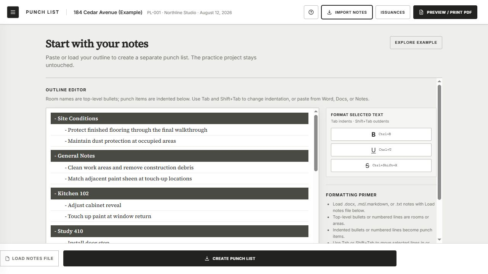
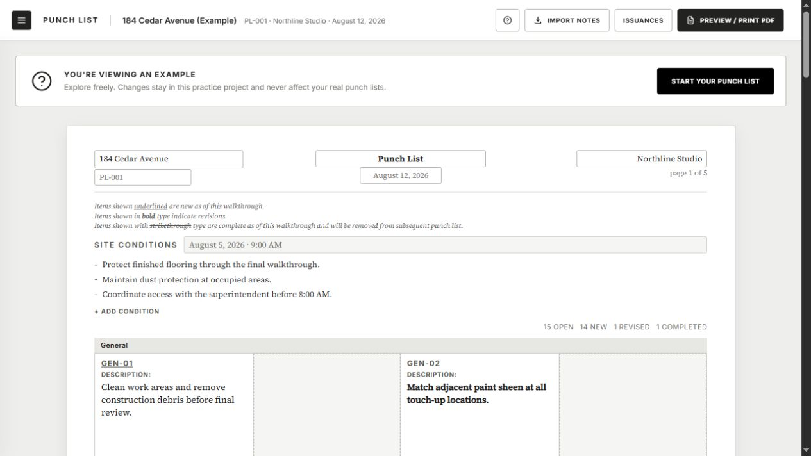
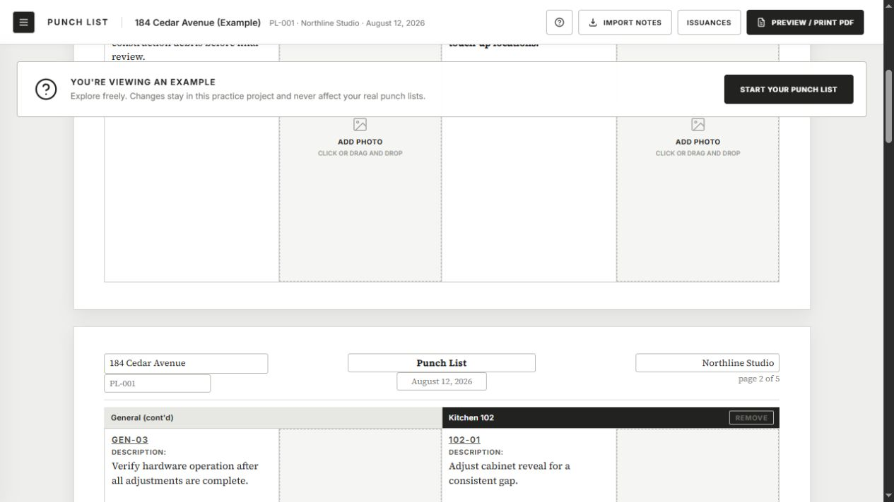
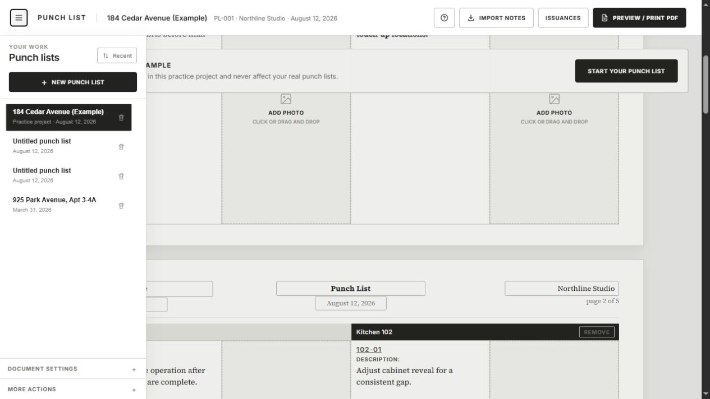
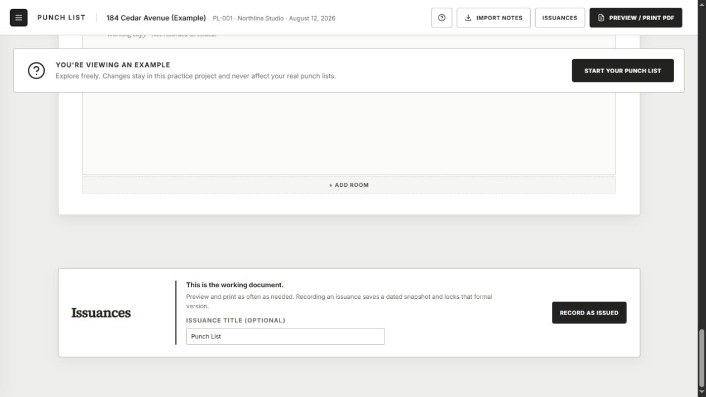

# Punch List complexity review

## Audit scope

Review the current first-run, working-grid, project-navigation, and issuance experience against the narrow product goal: an easy grid of punch-list items with associated photos that can carry forward over time.

## Overall verdict

The core photo grid still works, but it is no longer the product's organizing idea. The interface now combines three different products in one surface: an outline importer, a WYSIWYG printable document editor, and a formal document-control/version-history system. The issuance layer is the largest source of conceptual complexity.

## Flow evidence

### 1. Start with notes — strained

The first screen asks the user to understand outline hierarchy, indentation, rich-text conventions, supported file types, merge behavior, and an example-project boundary before seeing the promised grid. The main task reads as document parsing rather than adding items and photos.

### 2. Explore the working document — mixed

The page preview is polished and trustworthy for printing. However, the editable working experience is visually framed as a five-page finished document. Page headers, site conditions, formatting legends, counts, and example guidance all compete with the item/photo grid.

### 3. Add photos to items — healthy core, cluttered context

The essential interaction is present: a numbered description next to a large photo target. This is the strongest part of the product. It is weakened by repeated print headers, page breaks, continuation labels, and a sticky example banner that covers part of the grid while scrolling.

### 4. Navigate projects — mixed

Basic project switching is understandable. The panel also introduces practice-project status, destructive controls, document settings, more actions, and—once issued—nested historical documents. This makes the project list carry document-control concepts unrelated to the everyday photo-grid task.

### 5. Record an issuance — unhealthy for the narrow goal

The issuance workspace introduces a formal state transition: optional title, dated snapshot, locked version, correction paths, old-version editing, reprinting, and history. Those concepts are internally coherent, but they force a user to reason about record policy when the actual need is usually just: keep open items, mark finished items done, add new items, and export the current list.

## What went wrong

The wrong turn was not preserving history. The wrong turn was making history a user-managed document lifecycle.

The product promise says it is a photo-forward printable-document tool, but the next decisions added immutable issues, corrections, locks, replacement rules, nested snapshots, and later direct editing of any prior snapshot. Each rule answered a real edge case, but every answer created another state and another recovery path. The product crossed from a simple tool into a document-control system without explicitly choosing that new product.

## Recommended carry-forward model

Use one living project with stable item records:

- Each item has a stable ID, room, description, photos, and a simple `Open` or `Done` status.
- Open items carry forward automatically. Nothing needs to be issued or copied.
- Adding items during a later walkthrough adds them to the same grid; an `Added on` date can preserve when they appeared.
- Done items leave the default grid and remain under a collapsed `Completed` section.
- `Export PDF` is consequence-free output. It does not lock, rename, branch, or change the project.
- If recovery is important, save automatic restore points in the background and place them under `More actions > Version history`. Do not make them part of the main workflow.

## Highest-impact changes

1. Make the item/photo grid the default workspace and move the page-faithful document to a separate Print Preview.
2. Replace Issuances, Corrections, and locked snapshots with `Open`, `Done`, and automatic carry-forward.
3. Make import an optional accelerator (`Import items`), not the product's front door.
4. Keep advanced document metadata and restore history out of the primary toolbar.

## Accessibility and evidence limits

From the screenshots, several controls rely on very small uppercase text, low-contrast gray copy, and compact targets. The repeated editable print fields also create a dense reading and focus order. Keyboard behavior, focus visibility, screen-reader announcements, responsive reflow, and actual contrast ratios were not fully tested in this visual review.
